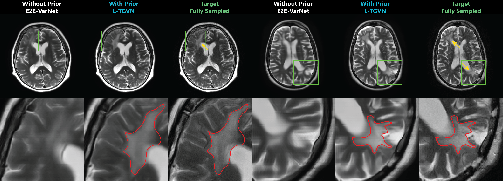

# L-TGVN: Leveraging Longitudinal Priors for Personalized Rapid MRI [](#citation) 
© 2026 New York University

> **News**
> - (Sept 30, 2026) L-TGVN was named **runner-up for the Best Paper Award** at *MICCAI 2026* 🎉  
> - (Aug 7, 2026) Our paper was selected for an **oral presentation** at *MICCAI 2026* 🎉  
> - (May 7, 2026) Our paper **_“L-TGVN: Leveraging Longitudinal Priors for Personalized Rapid MRI”_** was **early-accepted at *MICCAI 2026*** (top 9%) 🎉  
> - (May 7, 2026) A patent application was filed covering the work described in this publication.

## Conventional vs. Context-Aware Reconstruction
<p align="center">
  
</p>
<p align="center"><em>Conventional reconstruction uses only the current measurements; context-aware reconstruction also uses patient-specific context. L-TGVN uses prior MRI scans; EHR and other imaging are shown as future directions.</em></p>

## Project Repository Overview
This repository contains code and scripts for training and validating Longitudinal Trust Guided Variational Network (L-TGVN). The codebase utilizes PyTorch and Lightning. 

For convenience, a devcontainer that supports CUDA acceleration (CUDA 12.8) was added. Before building the container, you might want to update the `devcontainer.json` to access your data inside the container. You can do so by uncommenting the `mounts` key and adding the data paths. 

We prepared our in-house data as slice-by-slice `.npz` files containing the k-space and the target, but this can easily be modified in `data.py`. 

The repo follows the standard layout, and the devcontainer installs the L-TGVN package automatically with `pip install -e .`. If you prefer to install the requirements with pip or conda instead of using a Docker container, install the packages listed in lines 27–41 of the `Dockerfile` and then run `pip install -e .` from the repo root.

We provide the configuration files used for training L-TGVN in `configs` directory.

### Core Code Files
- **`scripts/main.py`**: Main script for training and evaluating L-TGVN.
- **`src/data.py`**: Contains data loading and preprocessing logic.
- **`src/loss.py`**: Implements various loss functions for training models.
- **`src/math_utils.py`**: Implements core mathematical operations.
- **`src/models.py`**: Defines the L-TGVN architecture used in the project.
- **`src/pl_data_module.py`**: Lightning data wrapper.

## Example Results
<p align="center">
  
</p>
<p align="center"><em>Two example cases at </em>R = 20×<em> (1D undersampling along a single phase-encoding direction). Green boxes mark the zoomed regions. Red contours outline the lesion visible in the fully sampled target: L-TGVN recovers it, while E2E-VarNet misses it. The E2E-VarNet baseline has a matched parameter count but no access to the longitudinal prior.</em></p>

## Citation
If you use this codebase or find it helpful in your research, please cite:

> A. Atalık, S. Chopra, and D. K. Sodickson,
"L-TGVN: Leveraging Longitudinal Priors for Personalized Rapid MRI,"
in *Medical Image Computing and Computer Assisted Intervention – MICCAI 2026*,
Lecture Notes in Computer Science, vol. 16887. Springer, Cham, 2027.
>
> [](https://doi.org/10.1007/978-3-032-38172-9_35)

```bibtex
@inproceedings{atalik2027ltgvn,
  author    = {Atal{\i}k, Arda and Chopra, Sumit and Sodickson, Daniel K.},
  title     = {{L-TGVN}: Leveraging Longitudinal Priors for Personalized Rapid {MRI}},
  booktitle = {Medical Image Computing and Computer Assisted Intervention -- MICCAI 2026},
  series    = {Lecture Notes in Computer Science},
  volume    = {16887},
  publisher = {Springer, Cham},
  year      = {2027},
  doi       = {10.1007/978-3-032-38172-9_35}
}
```
